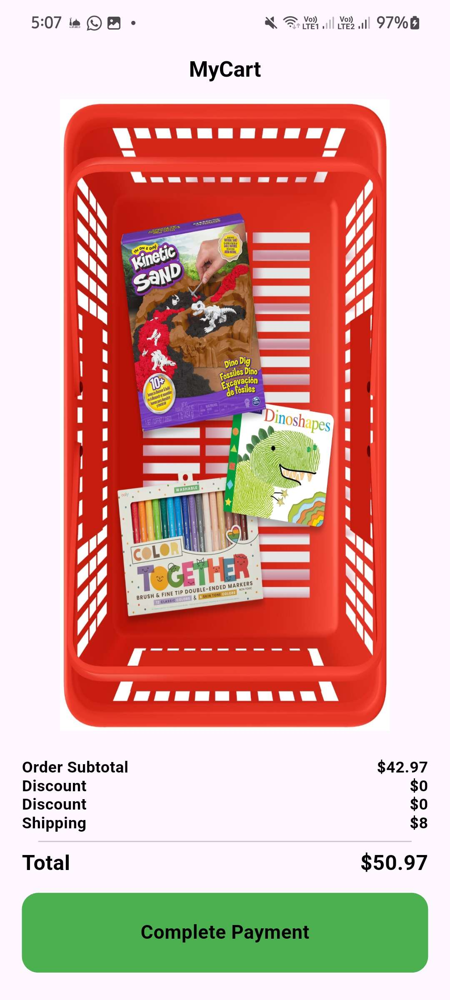
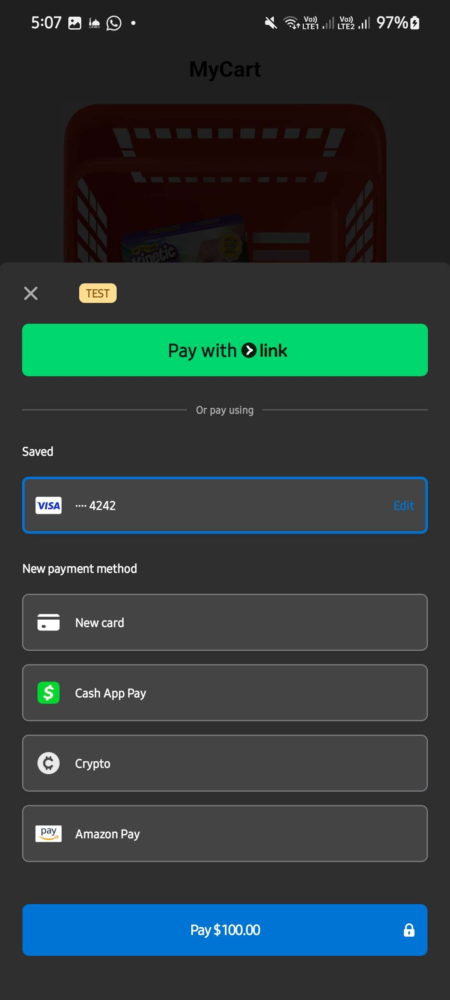
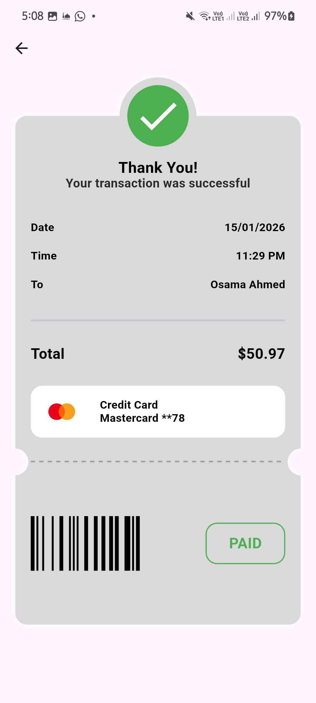
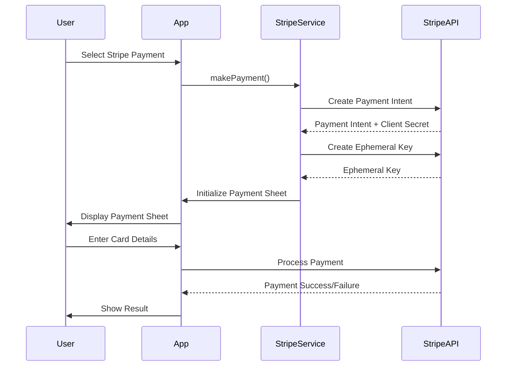
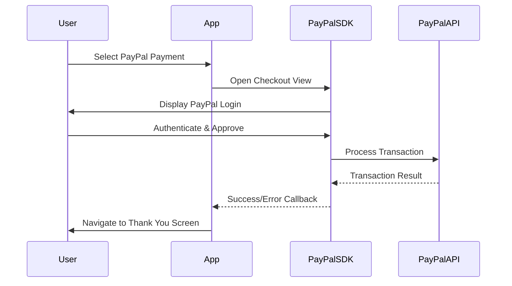

# Payme 💳

A Flutter practice project for implementing **Stripe** and **PayPal** payment gateway integrations. This is a learning/demonstration project and is **not intended for production use**.

> [!NOTE]
> This project uses test/sandbox modes for both payment providers and is designed purely for educational purposes to understand payment integration workflows.

---

## 📸 Screenshots

<!-- Add your screenshots here -->
| Cart View | Payment Methods | Stripe Payment | PayPal Payment | Payment Success |
|-----------|----------------|----------------|----------------|-----------------|
|  |  |  |  |  |

---

## ✨ Features

- 🔵 **Stripe Integration**
  - Payment Intent creation
  - Ephemeral Key generation
  - Payment Sheet UI
  - Customer management
  - Secure payment processing

- 🟡 **PayPal Integration**
  - PayPal Checkout flow
  - Transaction handling
  - Sandbox mode testing
  - Success/Error callbacks

- 🎨 **UI Components**
  - Shopping cart interface
  - Custom credit card widget
  - Payment method selection
  - Thank you/confirmation screen
  - Responsive design

---

## 🏗️ Architecture

The project follows **Clean Architecture** principles with a feature-based structure:

```
lib/
├── core/
│   ├── errors/           # Error handling (Failures)
│   ├── functions/        # Payment execution functions
│   ├── theme/            # App styling
│   ├── utils/            # API services & keys
│   └── widgets/          # Reusable UI components
│
└── features/
    └── checkout/
        ├── models/       # Data models (Payment Intent, PayPal models)
        ├── repos/        # Repository pattern (abstraction + implementation)
        ├── view/         # UI screens and widgets
        └── viewmodels/   # State management (BLoC/Cubit)
```

### Key Patterns Used

- **Repository Pattern**: Abstracts data layer from business logic
- **BLoC/Cubit**: State management for payment flows
- **Either Type (Dartz)**: Functional error handling
- **Dependency Injection**: Services injected through constructors

---

## 🚀 Getting Started

### Prerequisites

- Flutter SDK (^3.10.4)
- Dart SDK
- Stripe Account (for test API keys)
- PayPal Developer Account (for sandbox credentials)

### Installation

1. **Clone the repository**
   ```bash
   git clone https://github.com/yourusername/payme.git
   cd payme
   ```

2. **Install dependencies**
   ```bash
   flutter pub get
   ```

3. **Set up API Keys**

   Create a file at `lib/core/utils/api_keys.dart` with the following structure:

   ```dart
   class ApiKeys {
     // Stripe Keys
     static const String publishableKey = 'pk_test_YOUR_PUBLISHABLE_KEY';
     static const String stripeSecretKey = 'sk_test_YOUR_SECRET_KEY';
     
     // PayPal Keys
     static const String paypalClientId = 'YOUR_PAYPAL_CLIENT_ID';
     static const String paypalSecretKey = 'YOUR_PAYPAL_SECRET_KEY';
   }
   ```

   > [!IMPORTANT]
   > Never commit this file to version control. It's already included in `.gitignore`.

4. **Get your API credentials**

   **For Stripe:**
   - Go to [Stripe Dashboard](https://dashboard.stripe.com/test/apikeys)
   - Copy your **Publishable key** and **Secret key** (test mode)
   - Create a test customer and note the Customer ID

   **For PayPal:**
   - Go to [PayPal Developer Dashboard](https://developer.paypal.com/dashboard/)
   - Create a sandbox app
   - Copy your **Client ID** and **Secret** from the app credentials

5. **Update Customer ID** (Optional)

   In `lib/core/functions/stripe_payment_functions.dart`, update the customer ID:
   ```dart
   customerId: 'cus_YOUR_TEST_CUSTOMER_ID',
   ```

6. **Run the app**
   ```bash
   flutter run
   ```

---

## 📦 Dependencies

| Package | Purpose |
|---------|---------|
| `flutter_stripe` | Stripe SDK for Flutter |
| `flutter_paypal_payment` | PayPal integration |
| `flutter_credit_card` | Credit card UI widget |
| `flutter_bloc` | State management |
| `dio` | HTTP client for API calls |
| `dartz` | Functional programming (Either type) |

---

## 🔄 Payment Flow

### Stripe Payment Flow



**Steps:**
1. Create Payment Intent (amount, currency, customer ID)
2. Create Ephemeral Key (for customer session)
3. Initialize Payment Sheet (with secrets)
4. Present Payment Sheet to user
5. Process payment and handle result

### PayPal Payment Flow



---

## 🧪 Testing

This project uses **test mode** credentials:

- **Stripe Test Cards**: Use [Stripe test card numbers](https://stripe.com/docs/testing#cards)
  - Success: `4242 4242 4242 4242`
  - Decline: `4000 0000 0000 0002`
  - Any future expiry date and CVC

- **PayPal Sandbox**: Use sandbox accounts from your PayPal Developer Dashboard

---

## 📁 Project Structure Details

### Core Layer

- **`stripe_service.dart`**: Handles all Stripe API interactions
  - Payment Intent creation
  - Ephemeral Key generation
  - Payment Sheet initialization

- **`api_service.dart`**: Generic HTTP service using Dio
- **`api_keys.dart`**: Stores API credentials (gitignored)

### Features Layer

- **Models**: Data classes for API requests/responses
  - `PaymentIntentModel`
  - `PaymentIntentInputModel`
  - `EphemeralKeyModel`
  - `PaypalAmountModel`
  - `PaypalItemsListModel`

- **Repository**: 
  - `CheckoutRepo` (abstract)
  - `CheckoutRepoImpl` (concrete implementation)

- **ViewModel**: 
  - `PaymentCubit` manages payment state (Loading, Success, Failure)

---

## 🛠️ Configuration

### Android Setup

Ensure minimum SDK version in `android/app/build.gradle`:
```gradle
minSdkVersion 21
```

### iOS Setup

Update `ios/Podfile` for minimum iOS version:
```ruby
platform :ios, '13.0'
```

---

## ⚠️ Known Limitations

- This is a **practice project** and not production-ready
- Uses test/sandbox mode only
- Hardcoded payment amounts for demonstration
- Limited error handling for edge cases
- No backend server (API keys in client - for learning only)

> [!CAUTION]
> Never use secret API keys in client-side code in production. Always use a backend server to handle sensitive operations.

---

## 📚 Learning Resources

- [Stripe Flutter SDK Documentation](https://stripe.com/docs/payments/accept-a-payment?platform=flutter)
- [PayPal Developer Documentation](https://developer.paypal.com/docs/api/overview/)
- [Flutter BLoC Pattern](https://bloclibrary.dev/)
- [Clean Architecture in Flutter](https://resocoder.com/flutter-clean-architecture-tdd/)

---

## 🤝 Contributing

This is a personal learning project, but feel free to fork and experiment! If you find bugs or have suggestions, open an issue.

---

## 📄 License

This project is open source and available for educational purposes.

---

## 👨‍💻 Author

Created as a practice project to learn payment gateway integrations in Flutter.

---

## 🙏 Acknowledgments

- Stripe for comprehensive documentation
- PayPal for sandbox testing environment
- Flutter community for excellent packages
